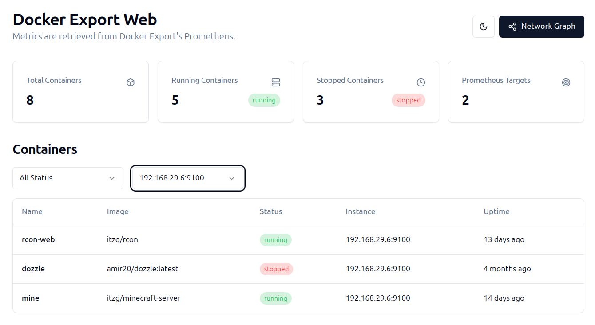
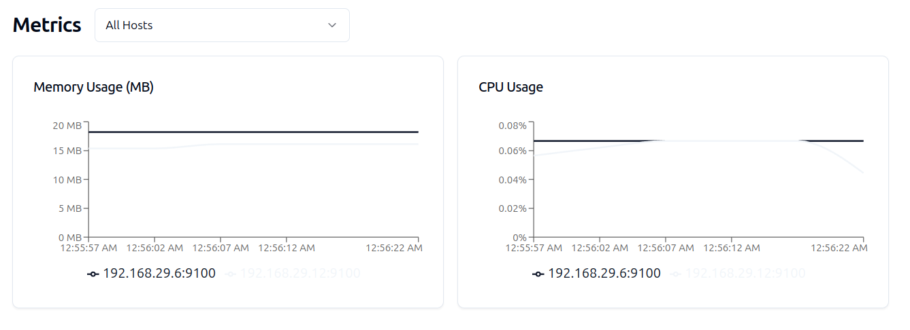

# Docker Export Web

Docker Export Web is a frontend application designed to display Docker metrics using Prometheus. It queries the Prometheus API to fetch and visualize Docker container data, such as CPU and memory usage, container status, and uptime.

## Metrics Exporter

The metrics exporter for Docker can be found at [tarcisiomiranda/docker-exporter](https://github.com/tarcisiomiranda/docker-exporter). This exporter provides Docker metrics to Prometheus, which are then visualized by this application.

## Features

- **Container Metrics**: View real-time metrics for Docker containers, including CPU and memory usage.
- **Network Graph**: Visualize container network relationships.
- **Responsive Design**: Built with a responsive UI for seamless use across devices.

## Interface Overview

### Graph Vis


### Table



### Consume



## Prerequisites

- Docker
- Docker Compose (optional, if you plan to use it for orchestration)

## Building the Docker image

You can build the Docker image in two ways:

1. Using Make (recommended):
```bash
# Uses default Prometheus URL (http://localhost:9090)
make build

# Or specify a custom Prometheus URL
make build VITE_API_BASE_URL=https://your-api-url.com
```

2. Using Docker directly:
```bash
# Uses default Prometheus URL (http://localhost:9090)
docker build -t docker-export-web .

# Or specify a custom Prometheus URL
docker build --build-arg VITE_API_BASE_URL=https://your-api-url.com -t docker-export-web .
```

## Running the container
```bash
docker run -p 8080:80 docker-export-web
```
The application will be available at `http://localhost:8080`

## Technologies Used

- React with TypeScript
- Vite for build tooling
- Tailwind CSS for styling
- Recharts for metrics visualization
- React Graph Vis for network visualization
- Docker for containerization
- Nginx as web server
